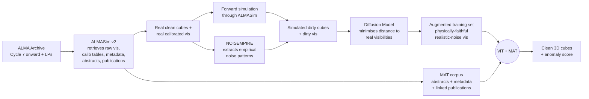
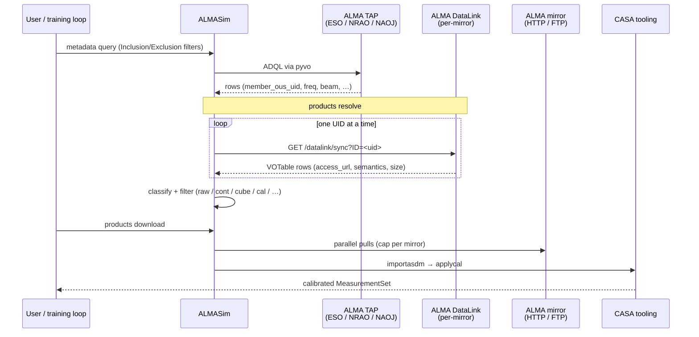
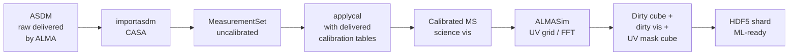

<div class="flex justify-start mb-4">
  
</div>

<div class="text-3xl font-bold leading-tight mt-2" style="color:#070068;">
The MADIV Development Study<br/>
and AI-Assisted Development<br/>
at SKA Observatory
</div>

<div class="text-base mt-6" style="color:#333333;">
Deep learning for ALMA imaging — and the petabyte-scale data-access gap it exposes
</div>

<div class="mt-8 text-sm" style="color:#555555;">
Michele Delli Veneri &nbsp;·&nbsp; SKA Observatory<br/>
IVOA Interoperability Meeting — Strasbourg 2026
</div>

<div class="mt-6 mx-auto max-w-2xl border-l-4 border-[#E70068] bg-[#E70068]/8 pl-4 py-2 text-xs text-left" style="color:#333333;">
  Co-funded by <span class="text-[#E70068] font-semibold">ESO</span> and <span class="text-[#E70068] font-semibold">SKAO</span>. Builds on the ESO BRAIN development study (Guglielmetti et al. 2024) and the <code>ALMASim</code> simulator.
</div>

<div class="abs-br m-6 text-xs" style="color:#777777;">
Data Curation & Preservation IG &nbsp;·&nbsp; Knowledge Discovery IG
</div>

<!--
20-minute slot. Two narrative beats:
1. MADIV — why deep learning, what BRAIN taught us, why training on real ALMA archival data
   is now mandatory, and the petabyte-scale data-infrastructure gap that opens.
2. AI-assisted development at SKAO — coding agents, agentic pipelines, dev practice (TBD).
-->

---

# Outline

<v-clicks>

1. **Why now** — ALMA's Wideband Sensitivity Upgrade and the imaging bottleneck
2. **What BRAIN taught us** — `DeepFocus`, `ALMASim`, and the simulation-to-real generalisation gap
3. **MADIV in one slide** — ViT + Metadata-Aware Transformer for direct imaging from visibilities
4. **The three work packages** — data, pipeline, validation
5. **ALMASim today** — library-first, TAP + DataLink under the hood
6. **The data-access gap** — DataLink was not built for PB-scale bulk training sets
7. **A call to the IVOA community** — what *ML-ready* products would have to look like
8. **AI-assisted development at SKAO** — *(part 2 — to be filled in)*

</v-clicks>

---
layout: section
---

# 1 · The ALMA imaging bottleneck

ALMA 2030, the WSU, and why classical CLEAN is running out of runway

---

# ALMA is about to flood its own pipeline

<div class="grid grid-cols-2 gap-8 text-sm">

<div>

The **Wideband Sensitivity Upgrade (WSU)** quadruples ALMA's instantaneous bandwidth and dramatically increases data volume and cube complexity.

- ALMA today: **~1 TB / day** of science data
- ALMA WSU: **at least an order of magnitude more**, with cubes **two orders of magnitude larger** than today's GB-scale cubes
- Looking further out, the **ALMA 2040** vision pushes the trend further still

Image reconstruction is the choke point. Today's products are dominated by **CLEAN** (`tclean` in CASA) — mature, well-understood, but:

1. **Computationally heavy** — channel-by-channel, scales poorly with cube size
2. **Hard to parallelise** — repeated gridding and Fourier inversions
3. **Morphologically biased** — optimised for point sources; struggles with extended, low-surface-brightness emission
4. **Human-intensive** — parameter tuning, masking, QA inspection per dataset

</div>

<div>

<div class="border-l-4 border-[#E70068] bg-[#E70068]/8 pl-4 py-3 text-xs">
  <div class="font-semibold mb-1">The ALMA Science Archive already feels the strain</div>
  Mitigation steps applied during pipeline imaging — to keep delivery times reasonable — mean the archive is <b>missing many of the images</b> the pipeline would otherwise produce. <span class="opacity-70">— BRAIN final report, §1</span>
</div>

<div class="mt-3 border-l-4 border-[#E70068] bg-[#E70068]/8 pl-4 py-3 text-xs">
  <div class="font-semibold mb-1">What the community is asking for</div>
  The ALMA 2030 development roadmap calls for <b>faster, more automated imaging</b> with better handling of extended emission and tighter integration with archival reprocessing.
</div>

<div class="mt-3 text-xs opacity-75">
This is the gap MADIV aims at — an AI imaging pipeline that scales with the WSU data rate and recovers extended emission better than classical CLEAN.
</div>

</div>
</div>

---
layout: section
---

# 2 · What BRAIN taught us

ESO Internal ALMA Development Study (2020–2024) — Guglielmetti, Delli Veneri, Tychoniec et al.

---

# BRAIN in one slide

<div class="grid grid-cols-2 gap-6 text-sm">

<div>

The ESO **BRAIN** study (*Bayesian Reconstruction with Adaptive Image Notion*) explored two complementary AI techniques for ALMA imaging:

- **`RESOLVE`** — astro-statistics, Bayesian imaging via Information Field Theory (NIFTy), with native uncertainty quantification
- **`DeepFocus`** — astro-informatics, a deep-learning **meta-learner** that finds the best 3D detection/deconvolution architecture for the data at hand

Tested on **simulated** ALMA cubes plus **real** data: HL Tau, BR1202, **DSHARP** and **ALCHEMI** Large Programs, RX J1347.5-1145 (SZ effect).

Companion tool: **`ALMASim`** — open-source ALMA simulator integrated with the archive. **`NOISEMPIRE`** — empirical noise model extracted from real ALMA images.

</div>

<div>

<div class="border-l-4 border-emerald-500 bg-emerald-50/40 dark:bg-emerald-900/15 pl-4 py-3 text-xs">
  <div class="font-semibold mb-1">DeepFocus headline numbers</div>
  On 1000 simulated ALMA cubes (256×256×128):
  <ul class="mt-1 ml-4 list-disc">
    <li><b>Blobs Finder</b> reconstruction on the whole test set: <b>23 s</b> (1× NVIDIA Tesla K20)</li>
    <li><b>tclean</b> with 200 iterations: <b>4.3 min/cube</b>, ~1.5 h on 50-cube parallel (400 CPUs)</li>
    <li>Net speed-up: <b>~200×</b> on that hardware</li>
  </ul>
</div>

<div class="mt-3 border-l-4 border-[#E70068] bg-[#E70068]/5 pl-4 py-3 text-xs">
  <div class="font-semibold mb-1">Residual quality</div>
  Blobs Finder residuals within <b>±1σ</b>; <code>tclean</code> residuals deviate beyond <b>±5σ</b> on the same test set (BRAIN final report, §5.5).
</div>

<div class="mt-3 text-xs opacity-70">
Conclusion: <b>deep learning works</b> for ALMA imaging — when the training distribution matches the test distribution.
</div>

</div>
</div>

---

# But there is a catch

<div class="text-sm">

BRAIN trained `DeepFocus` primarily on **simulated** cubes. The reason is uncomfortable but simple — at the time, training on real archival data at scale was effectively impossible:

</div>

<div class="mt-3 grid grid-cols-2 gap-6 text-xs">

<div class="border-l-4 border-amber-500 pl-3 py-3">
  <div class="font-semibold mb-1">Archive access at scale</div>
  Retrieving sufficient real data "would require <b>thousands of requests via the helpdesk</b> and extensive processing with CASA, averaging <b>1–2 hours per cube</b>, rendering the process impractical."<br/>
  <span class="opacity-70 mt-1 block">— BRAIN final report, §5.5.2</span>
</div>

<div class="border-l-4 border-amber-500 pl-3 py-3">
  <div class="font-semibold mb-1">Simulation noise ≠ real noise</div>
  Real ALMA noise is <b>spatially correlated, non-Gaussian, baseline-dependent</b>. CASA's <code>simalma</code> / <code>simobserve</code> miss those patterns. <code>NOISEMPIRE</code> was developed to extract empirical noise from real images and inject it back into simulations.
</div>

<div class="border-l-4 border-amber-500 pl-3 py-3">
  <div class="font-semibold mb-1">Limited morphological diversity</div>
  Single-Gaussian line profiles, point sources, simple disks. Real ALMA targets include complex velocity structures, molecular clouds, mosaics, AGN, protoplanetary substructure.
</div>

<div class="border-l-4 border-amber-500 pl-3 py-3">
  <div class="font-semibold mb-1">DeepGRU et al. don't generalise</div>
  Models trained on simulation distributions <b>do not transfer reliably</b> to real ALMA cubes. This is the well-known ML failure mode — and it bites hard in radio interferometry.
</div>

</div>

<div class="mt-4 text-sm">

**Lesson:** the next generation of AI imagers has to **train on real archival data at scale**, augmented with physically-faithful simulations — not the other way round.

</div>

---
layout: section
---

# 3 · MADIV — Metadata-Aware Direct Imaging from Visibilities

co-funded by ESO and SKAO &nbsp;·&nbsp; 36 months &nbsp;·&nbsp; starts Q2 2026

---

# What MADIV is trying to build

<div class="grid grid-cols-2 gap-6 text-sm">

<div>

A **Visual Transformer (ViT)** that reconstructs **3D clean data cubes directly from calibrated visibilities**, conditioned on a **Metadata-Aware Transformer (MAT)** that ingests:

- ALMA **proposal abstracts**
- Observation **metadata** (band, configuration, integration, source class, …)
- **Linked publications** for that programme

…and turns them into priors the ViT can attend to.

Plus an **anomaly-scoring** head: reconstructions that fall outside the learned feature distribution get flagged for human review — calibration errors, instrumental artefacts, or *new astrophysics*.

</div>

<div>

<div class="border-l-4 border-[#E70068] bg-[#E70068]/8 pl-4 py-3 text-xs">
  <div class="font-semibold mb-1">Why a transformer, not a U-Net?</div>
  <ul class="mt-1 ml-4 list-disc">
    <li>Real spectral structures persist coherently <b>across many channels</b>; noise does not — 3D attention can exploit that, channel-by-channel CNNs cannot</li>
    <li>Adjacent channels are <b>redundant</b>; treating them independently wastes compute</li>
    <li>Self-attention naturally handles <b>long-range</b> spatial-spectral dependencies — extended emission, mosaics, broad lines</li>
  </ul>
</div>

<div class="mt-3 border-l-4 border-[#E70068] bg-[#E70068]/8 pl-4 py-3 text-xs">
  <div class="font-semibold mb-1">Targets</div>
  Cycle 7 onward, plus Large Programs: <b>DSHARP, ACES, ALMAGAL, ALMA-IMF, ALCHEMI</b>. Public CLEAN products exist for all of these — straightforward A/B comparison.
</div>

</div>
</div>

---

# The training-set augmentation pipeline

<div class="grid grid-cols-[1.4fr_1fr] gap-6 items-start">

<div>



</div>

<div class="text-xs space-y-3">

<div class="border-l-2 border-emerald-500 pl-2">
<div class="font-semibold">ALMASim v2</div>
Refactored to fetch raw vis, calibration, **abstracts**, metadata, **publications** from the archive — not just generate synthetic skies.
</div>

<div class="border-l-2 border-[#E70068] pl-2">
<div class="font-semibold">NOISEMPIRE</div>
Empirical noise extracted from real ALMA images is **injected** into simulated dirty cubes.
</div>

<div class="border-l-2 border-violet-500 pl-2">
<div class="font-semibold">Diffusion refinement</div>
A DM is trained to make simulated visibilities **indistinguishable** from real ones — *physically-plausible* data augmentation.
</div>

<div class="border-l-2 border-amber-500 pl-2">
<div class="font-semibold">ViT + MAT</div>
The augmented vis + MAT priors feed the ViT, which outputs cleaned cubes. Anomaly score on the side.
</div>

</div>

</div>

---

# Three work packages, 36 months

<div class="grid grid-cols-3 gap-3 text-xs">

<div class="border-l-4 border-emerald-500 bg-emerald-50/40 dark:bg-emerald-900/15 pl-3 py-3">
  <div class="font-semibold mb-1">WP1 · M1–12</div>
  <div class="opacity-90 mb-2">Enhanced ALMASim + dataset</div>
  <ul class="ml-4 list-disc">
    <li>Archive integration (raw vis, calib, metadata, abstracts, papers)</li>
    <li>Web app (FastAPI + Svelte)</li>
    <li>NOISEMPIRE integration</li>
    <li>Diffusion model refinement</li>
    <li>Physical data augmentation</li>
    <li><b>D1.1</b> ALMASim v2 release</li>
    <li><b>D1.2</b> Public multi-modal dataset</li>
  </ul>
</div>

<div class="border-l-4 border-[#E70068] bg-[#E70068]/5 pl-3 py-3">
  <div class="font-semibold mb-1">WP2 · M10–24</div>
  <div class="opacity-90 mb-2">ViT + MAT pipeline</div>
  <ul class="ml-4 list-disc">
    <li>ViT architecture for visibility-domain input</li>
    <li>3D spatial-spectral attention</li>
    <li>MAT ingestion of abstracts + metadata + papers</li>
    <li>Anomaly scoring module</li>
    <li>End-to-end automated pipeline</li>
    <li><b>D2.1–D2.4</b> components &amp; integrated pipeline</li>
  </ul>
</div>

<div class="border-l-4 border-violet-500 bg-violet-50/40 dark:bg-violet-900/15 pl-3 py-3">
  <div class="font-semibold mb-1">WP3 · M20–36</div>
  <div class="opacity-90 mb-2">Validation &amp; science demos</div>
  <ul class="ml-4 list-disc">
    <li>Training/validation on Cycle 7+ archival data</li>
    <li>Benchmarking vs <code>tclean</code> &amp; other baselines</li>
    <li>Science demonstrations (PPDs, high-z galaxies)</li>
    <li>Readiness for archival mining + RADPS integration</li>
    <li><b>D3.1</b> benchmarks, <b>D3.2</b> demo papers, <b>D3.3</b> prototype</li>
  </ul>
</div>

</div>

<div class="mt-4 text-xs opacity-80">

**Compute backbone.** STILES ADHOC (UniNa Federico II) — 2 PFLOPS steady-state, 12 PB hot disk, 22 × dual-H100 + 12 × dual-L40 GPU nodes; **NaFCI** (Onsala / Chalmers); SKAO HQ workstations and HPC.

</div>

<div class="mt-3 text-xs opacity-70">

**Why this matters beyond ALMA.** The same architecture, dataset patterns, and AI workflows are transferable to <b>SKA</b> and <b>ngVLA</b> — both will need scalable, automated imaging at PB/yr data rates.

</div>

---
layout: section
---

# 4 · ALMASim today

What we already have — and what WP1 has to upgrade

---

# ALMASim is a library-first Python stack

<div class="grid grid-cols-2 gap-6 text-sm">

<div>

ALMASim has been refactored from "GUI + scripts" into a **library-first** package with reusable services:

```
src/almasim/
  services/
    metadata/       ← ALMA TAP query + normalisation
    download/       ← DataLink resolve + parallel pull
    archive/        ← ASDM unpack, applycal
    interferometry/ ← UV sampling, baselines, noise, TP
    imaging/        ← deconvolution, TP+INT combination
    products/       ← MS export, HDF5 shards, cubes
    astro/          ← spectral lines, redshift
    compute/        ← sync / local / Dask / Slurm / k8s
  skymodels/        ← Point, Gaussian, Extended,
                      Galaxy Zoo, Hubble100, Molecular,
                      Diffuse, Illustris TNG
  cli.py            ← typer entrypoint
```

Same staged API drives the **CLI**, a **FastAPI** backend, and Jupyter notebooks.

</div>

<div>

<div class="border-l-4 border-[#E70068] bg-[#E70068]/8 pl-4 py-3 text-xs">
  <div class="font-semibold mb-1">Why library-first</div>
  WP1 needs ALMASim to be <b>callable</b> from training loops, Dask graphs, Slurm jobs, and a browser-based UI — without rewriting the simulation logic four times.
</div>

<div class="mt-3 border-l-4 border-[#E70068] bg-[#E70068]/8 pl-4 py-3 text-xs">
  <div class="font-semibold mb-1">Outputs</div>
  Dirty cube, beam cube, UV mask, dirty / model visibilities, ML-ready <b>HDF5 shards</b> (clean + dirty + vis + mask + metadata), and native MeasurementSets via <code>casatools</code> or <code>python-casacore</code>.
</div>

<div class="mt-3 text-xs opacity-70">

Optional <code>[casa]</code> extra (Linux x86-64) for native MS export and <code>applycal</code>; <code>[ms-casacore]</code> fallback works everywhere.

</div>

</div>
</div>

---

# The CLI mirrors the staged pipeline

<div class="text-sm mb-2">

Four sub-apps, one for each stage of the *real-data* workflow. Each is a thin wrapper over the corresponding `services/` module — same API as the library.

</div>

```bash {all|1|2-4|6|8|10|12|14}
almasim --help

almasim metadata query \
  --science-keyword "Galaxies" --band 6 --array-type 12m \
  --observation-date-range 2019-10-01 2024-09-30 \
  --qa2-status Pass --public-only \
  --out-csv metadata.csv

almasim products resolve   --metadata-csv metadata.csv --out-csv products.csv

almasim products download  --products-csv products.csv --type raw --parallel 8

almasim products unpack    --products-csv products.csv  # ASDM → MS

almasim products calibrate --products-csv products.csv  # applycal (casatasks)

almasim simulation run     --skymodel point --backend local --save-format h5
```

<div class="mt-3 grid grid-cols-2 gap-3 text-xs">
  <div class="border-l-4 border-emerald-500 pl-3 py-2">
    <b>metadata</b> → <b>products</b> → <b>simulation</b> / <b>image</b> mirrors what BRAIN had to do by hand: query, locate, fetch, unpack, calibrate, then use.
  </div>
  <div class="border-l-4 border-[#E70068] pl-3 py-2">
    <code>products resolve</code> is the one that takes us into <b>IVOA DataLink</b> — and where the trouble starts at PB scale.
  </div>
</div>

---

# Under the hood — ALMASim talks TAP and DataLink

<div class="grid grid-cols-[1.4fr_1fr] gap-6 items-start">

<div>



</div>

<div class="text-xs space-y-3">

<div>
<div class="font-semibold text-slate-800 dark:text-slate-100">1 · Discovery via TAP</div>
<div class="opacity-80 mt-0.5"><code>pyvo.dal.TAPService</code> across three mirrors. ALMASim retries each. Filters (science keyword, band, array type, FOV, QA2, date) are translated to ADQL and normalised against stable application fields.</div>
</div>

<div class="border-l-2 border-[#E70068] pl-2">
<div class="font-semibold">2 · Resolution via DataLink</div>
<div class="opacity-80 mt-0.5">For every <code>member_ous_uid</code>: <code>GET /datalink/sync?ID=&lt;uid&gt;</code>. Parse the VOTable. Each row → <code>(access_url, content_length, content_type, semantics)</code>. Classify into <code>raw / continuum / cube / calibration / preview / other</code>.</div>
</div>

<div class="border-l-2 border-emerald-500 pl-2">
<div class="font-semibold">3 · Bulk download</div>
<div class="opacity-80 mt-0.5">Parallel pulls across mirrors, with per-mirror and global concurrency caps (rclone-style backpressure).</div>
</div>

<div class="border-l-2 border-amber-500 pl-2">
<div class="font-semibold">4 · ASDM → MS → applycal</div>
<div class="opacity-80 mt-0.5">CASA <code>importasdm</code>, then <code>applycal</code> with delivered calibration tables. <b>This step is where the wheels start coming off.</b></div>
</div>

</div>

</div>

---
layout: section
---

# 5 · The data-access gap

DataLink was not designed for *training* — it was designed for *retrieval*

---

# What works, what doesn't

<div class="grid grid-cols-2 gap-6 text-sm">

<div>

**What works well today**

- **TAP / ObsCore** discovery is excellent — `pyvo` + ADQL gives us everything we need to build a science-keyword-filtered cohort
- **DataLink** correctly resolves a member OUS UID to its set of files — VOTable, `access_url`, `semantics`, `content_length`
- File-level transport over HTTP / FTP works at single-file scale

**What stops working at MADIV scale**

- We're not asking for **one** dataset; we're asking for **thousands** of OUSs from Cycle 7 onward — repeated several times across LPs
- That's **tens to hundreds of TB** of raw visibilities + calibration tables, and **PB-scale** if we move to all Cycles
- Sustained bulk transfer at this scale is **not what DataLink was designed for**

</div>

<div>

<div class="border-l-4 border-amber-500 bg-amber-50/40 dark:bg-amber-900/15 pl-4 py-3 text-xs">
  <div class="font-semibold mb-1">Three concrete pain points</div>
  <ol class="mt-1 ml-4 list-decimal space-y-1">
    <li><b>Per-product round trips</b>. One <code>datalink/sync</code> call per <code>member_ous_uid</code>; one HTTP fetch per file. Thousands of OUSs × dozens of files each = a lot of round trips against a small set of mirrors.</li>
    <li><b>No bulk-transfer mode</b>. There is no standard way to say <i>"give me the raw vis for every OUS in this list, in one negotiated transfer"</i>.</li>
    <li><b>Mirror-side rate caps</b>. ALMASim hard-codes a per-mirror concurrency limit because the mirrors are <b>shared infrastructure</b> with the wider community — we cannot saturate them.</li>
  </ol>
</div>

<div class="mt-3 border-l-4 border-amber-500 bg-amber-50/40 dark:bg-amber-900/15 pl-4 py-3 text-xs">
  <div class="font-semibold mb-1">From BRAIN, verbatim</div>
  Retrieving sufficient real data "would require <b>thousands of requests via the helpdesk</b> and extensive processing with CASA, averaging <b>1–2 hours per cube</b>."
</div>

</div>
</div>

---

# Raw visibilities are not training data

<div class="text-sm mb-3">

Even if we transfer everything, what we get is **not** ML-ready. ALMASim has to do this for every OUS, every time:

</div>

<div class="grid grid-cols-2 gap-6 text-xs">

<div>



</div>

<div>

<div class="border-l-4 border-[#E70068] pl-3 py-2">
  <b>importasdm.</b> CASA-only. <b>Linux x86-64</b> wheels only. Ten to hundreds of GB per OUS for big LPs.
</div>

<div class="mt-2 border-l-4 border-[#E70068] pl-3 py-2">
  <b>applycal.</b> Calibration tables ship with the delivery. CASA-only. Failure modes (missing antennas, flagged scans) are dataset-specific.
</div>

<div class="mt-2 border-l-4 border-[#E70068] pl-3 py-2">
  <b>UV gridding + FFT.</b> Cube dims (Nx · Ny · Nch) decide memory footprint; mosaics multiply by Nfields.
</div>

<div class="mt-2 border-l-4 border-amber-500 pl-3 py-2">
  <b>Domain expertise required.</b> Every step above is <i>radio-interferometric specialist work</i>. Most ML groups don't have it — and don't <i>need</i> it if the products are delivered ML-ready.
</div>

</div>

</div>

<div class="mt-4 text-sm">

**The cost is duplicated.** Every group training an imaging model has to repeat this — the same calibration, the same gridding, the same HDF5 sharding — against the same archive. The compute and bandwidth are paid many times over.

</div>

---
layout: section
---

# 6 · A call to the IVOA community

What would *ML-ready* delivery look like — and why it benefits more than MADIV

---

# Bulk + processed + standardised

<div class="grid grid-cols-2 gap-6 text-sm">

<div>

**The asks, concretely**

1. **A bulk-transfer profile** for DataLink-resolved products — one negotiated session, many files, with backpressure and resume. Whether that's an extension of DataLink, a SODA shape, or a sibling service is a question for this room.
2. **A processed-products tier**. Calibrated MS, dirty cubes, UV masks — *delivered*, not reconstructed by every consumer. The archive runs the pipeline once, the community trains many models.
3. **A standardised "ML-ready" container**. HDF5 (or Zarr) shards with explicit conventions for clean / dirty / mask / metadata.
4. **Metadata coverage in TAP**. Today, ALMA proposal abstracts and the *linked publications* MADIV needs for the MAT are **not exposed through TAP**. They have to be fetched by direct ALMA-staff support. This is fixable.

</div>

<div>

<div class="border-l-4 border-emerald-500 bg-emerald-50/40 dark:bg-emerald-900/15 pl-4 py-3 text-xs">
  <div class="font-semibold mb-1">Why this is bigger than MADIV</div>
  <ul class="mt-1 ml-4 list-disc">
    <li><b>SKA Regional Centres</b> will face exactly this — only at <b>700 PB/yr</b> rather than 1 TB/day</li>
    <li><b>ngVLA</b> sits in the same regime</li>
    <li>Every <b>ML-for-radio</b> group is building a private version of the ALMASim pipeline today; that work is fungible</li>
    <li>This is the IVOA Strasbourg audience's <b>natural problem space</b> — discovery, access, transport, semantics — applied to a use case (large-scale training) the standards weren't originally written for</li>
  </ul>
</div>

<div class="mt-3 border-l-4 border-emerald-500 bg-emerald-50/40 dark:bg-emerald-900/15 pl-4 py-3 text-xs">
  <div class="font-semibold mb-1">Sister work</div>
  The <b>SRCNet Product Streamer</b> (separate IVOA session, DSP WG) shows one way to negotiate dataset-level transport over DataLink for SKA. The MADIV ask is the same shape — just upstream, at ALMA.
</div>

</div>
</div>

---

# What we hope to bring back from this meeting

<v-clicks>

- **A signal** on whether a *bulk transfer + processed tier* belongs inside the DataLink remit, or alongside it as a new IVOA service.
- **Concrete patterns** other communities are already using — SODA shapes, multi-ID DataLink responses, transport profiles.
- **Metadata exposure** — what it would take to put proposal abstracts and linked publications behind TAP, with stable IVOIDs.
- **A community-curated, standards-conformant "ML-ready ALMA" tier** — even at modest scale, this would change what BRAIN-style studies can realistically attempt.
- **Connections** with groups solving the same problem on optical, IR, or X-ray archives. The ALMA shape will not be unique for long.

</v-clicks>

<div class="mt-6 p-4 bg-[#E70068]/8 border-l-4 border-[#E70068] text-sm">
  Closing the simulation-to-real gap is, fundamentally, a <b>community infrastructure problem</b>. MADIV is one of the projects that has to solve it for itself — but every group will hit it. Let's solve it once.
</div>

---
layout: section
---

# 7 · AI-assisted development at SKAO

How we are building MADIV — coding agents, agentic pipelines, dev practice

---

# AI-assisted development at SKAO — *to be filled in*

<div class="text-sm">

This second half of the talk will cover how the MADIV team, and SKAO more broadly, are integrating AI coding agents into day-to-day development:

</div>

<div class="mt-4 grid grid-cols-2 gap-4 text-xs">
  <div class="border-l-4 border-slate-300 dark:border-slate-600 pl-3 py-2 opacity-60">
    Coding agents for <b>code generation and review</b>
  </div>
  <div class="border-l-4 border-slate-300 dark:border-slate-600 pl-3 py-2 opacity-60">
    Agentic pipelines for <b>automated code curation</b>
  </div>
  <div class="border-l-4 border-slate-300 dark:border-slate-600 pl-3 py-2 opacity-60">
    AI-assisted <b>UI development</b> (FastAPI + Svelte for ALMASim v2)
  </div>
  <div class="border-l-4 border-slate-300 dark:border-slate-600 pl-3 py-2 opacity-60">
    Lessons learned, guardrails, what doesn't work
  </div>
</div>

<div class="mt-8 p-4 bg-amber-50/60 dark:bg-amber-900/15 border-l-4 border-amber-400 text-xs">
  <i>Placeholder slide — content to be drafted in collaboration with the SKAO dev practice team before the meeting.</i>
</div>

---
layout: center
class: text-center
---

# Thank you

<div class="text-base opacity-80 mt-6">
MADIV proposal &nbsp;·&nbsp; <code>ESO/CFP/129249/AMA</code><br/>
ALMASim &nbsp;·&nbsp; <code>github.com/MicheleDelliVeneri/ALMASim</code><br/>
BRAIN final report &nbsp;·&nbsp; Guglielmetti et al. 2024<br/>
Slides &nbsp;·&nbsp; <code>github.com/MicheleDelliVeneri/IVOA-Strasbourg-MADIV</code>
</div>

<div class="mt-10 text-sm opacity-60">
michele.delliveneri@skao.int &nbsp;·&nbsp; SKA Observatory
</div>
